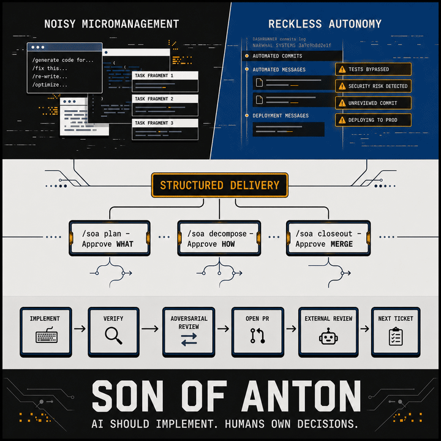

# Son of Anton

<p align="center">
  
</p>

The current default for AI-assisted development is one of two failure modes:
you're either babysitting the agent line by line, or you've handed it the
wheel and are hoping for the best. Son of Anton is neither.

Son of Anton is a delivery orchestrator for solo developers and small teams.
It enforces a simple discipline: there are exactly three moments where a
developer's judgment is irreplaceable, and the orchestrator owns everything
in between.

It runs on the agent you already use — Codex, Cursor, Copilot, Claude, or
anything else that reads `AGENTS.md`. The directory is named `.agents` for
a reason.

---

## The Three Gates

```
/soa plan       → you approve the WHAT
/soa decompose  → you approve the HOW
/soa closeout   → you approve DONE
```

**Gate 1 — Plan the WHAT.**
Before any ticket is written, `/soa plan` runs a grill-me session that forces
the AI to surface assumptions, constraints, and scope decisions back to you.
You say yes or refine. The AI does not proceed until you have.

**Gate 2 — Decompose the HOW.**
`/soa decompose` turns the approved plan into a ticket stack — ordered,
dependency-aware, sized for review. You look at the ticket list and approve it.
Architectural judgment belongs to you. Ticket authorship belongs to the agent.

**Gate 3 — Approve DONE.**
After each ticket ships, an adversarial subagent reviews the implementation
before the PR is opened. When the full phase is done, you decide whether the
work is complete enough to accept and run `/soa closeout`. That squash-merges
the stack onto main. Nothing merges without you.

Everything between the gates — implementation, test scaffolding, worktree
management, PR creation, CI polling, review triage — is owned by the
orchestrator.

---

## What the Workflow Looks Like

```bash
# When you have a concrete idea
/soa plan                                    # grill-me → approved plan → docs/product/plans/
/soa decompose docs/product/plans/phase-N.md # ticket stack → you approve the list
/soa execute phase-N                         # orchestrator delivers ticket by ticket
/soa triage-ticket PR#19                     # reconcile late AI review on a done ticket PR
/soa triage-standalone PR#19                 # run standalone AI-review triage on a non-ticket PR
/soa closeout phase-N                        # you approve; stacked PRs squash-merge to main

# When the idea needs shaping first (optional)
/soa ideate                                  # brainstorm → docs/product/drafts/<slug>.md
/soa plan docs/product/drafts/<slug>.md      # grill the draft → approved plan
# then decompose → execute → closeout as above

# Runtime policy overrides — no config file edits required
/soa execute phase-N --boundary-mode gated   # override boundary mode for this run
/soa execute phase-N --subagent-review-policy disabled --pr-review-policy skip_doc_only
/soa resume phase-N --boundary-mode cook     # change policy mid-run on resume
/soa resume phase-N --baseline orchestrator  # adopt current repo defaults when policy diverged
/soa resume phase-N --baseline run-policy    # keep persisted run policy when repo config changed
```

`/soa ideate` is optional. Use it when intention is too half-formed to yield
a concrete plan directly — it lands a draft at `docs/product/drafts/` that
feeds straight into `/soa plan <path>`. If the idea is already clear, or you
are working from a retrospective follow-up, skip ideate and go straight to
`/soa plan`.

Between `execute` and `closeout` you are not needed. The orchestrator
opens the worktree, implements, verifies, runs the adversarial review,
opens the PR, polls for external AI review comments, triages them, and
advances to the next ticket. It stops at defined boundaries and tells you
exactly what to type to resume.

If late external AI review comments arrive after a ticket PR is already `done`,
use `/soa triage-ticket PR#<number>` so the agent resolves the PR back to its
delivery state and runs `triage-ticket`. For non-ticketed PRs, use
`/soa triage-standalone PR#<number>`, which runs the standalone triage
path instead.

---

## What You Get

- **Delivery orchestrator** — TypeScript CLI that drives the ticket loop,
  manages worktrees and branches, records review outcomes, and enforces
  stop conditions. Runs via Bun or Node.
- **Skill layer** — behavioral instructions in `.agents/skills/` that any
  agent can read, plus per-agent adapters for platforms with specific file
  conventions (see [Agent compatibility](#agent-compatibility) below).
- **Adversarial subagent review** — after each ticket, a second AI pass checks
  the implementation assuming the first one cut corners. When the review runs
  through an executor-owned CLI runner (`claude-cli` or `codex-exec`), it
  patches findings autonomously and writes a durable proof artifact. When the
  review runs agent-to-agent, the primary agent triages findings before
  publishing.
- **Stacked PR model** — each ticket gets its own branch and PR, stacked in
  dependency order. Closeout squash-merges the whole phase onto main cleanly.
- **Migration runner** — when Son of Anton ships structural changes, `bun run sync`
  applies them to your repo automatically. You pull and run; the migration runs itself.
- **Agent-rule injection** — `bun run sync` injects Son-of-Anton's skill-trigger
  rules into `AGENTS.md` so every agent in your repo knows which skills to invoke
  and when. Idempotent: re-running is always safe.

---

## Agent Compatibility

Son of Anton's core lives in `.agents/skills/` and `AGENTS.md`. Any agent
that reads those conventions works without additional configuration.

Claude Code is the exception — it has its own file preferences (`CLAUDE.md`,
`.claude/skills/`) baked into the platform. `soa-sync.sh` handles this
automatically: it injects a `<!-- soa:start -->` block into `CLAUDE.md` and
symlinks `.claude/skills/soa*` alongside the universal `AGENTS.md` block.

---

## Install

### Step 1 — Embed the subtree

```bash
git subtree add --prefix .son-of-anton https://github.com/cesarnml/son-of-anton.git main --squash
```

Son of Anton embeds at `.son-of-anton/`. No submodules, no external service,
no npm package — the files are real tracked files in your repo history.

### Step 2 — Sync

```bash
bash .son-of-anton/scripts/soa-sync.sh
```

This wires the skill layer for your agents, injects agent rules into `AGENTS.md`
(and `CLAUDE.md` if you use Claude Code), creates the `.agents` and `tools`
symlinks for the orchestrator, and runs any pending structural migrations.

Add to `package.json` for convenience:

```json
{
  "scripts": {
    "sync": "bash .son-of-anton/scripts/soa-sync.sh",
    "deliver": "bun run .son-of-anton/scripts/deliver.ts",
    "closeout-stack": "bun run .son-of-anton/scripts/closeout-stack.ts"
  }
}
```

Add `.son-of-anton/` to `.prettierignore`, `.eslintignore`, or your linter's
equivalent. The subtree must stay tracked and unignored by git, but your
formatter should not touch it.

Add `docs/product/delivery/*/reviews/**` to your `cspell.json` `ignorePaths` to
prevent spellcheck failures on review artifacts.

`soa-sync.sh` creates `orchestrator.config.json` at your repo root if it does not
exist yet. Review it and adjust `defaultBranch`, `runtime`, and `packageManager` for
your repo before running the orchestrator.

### Step 3 — Start

```bash
/soa plan         # if you have a concrete idea
/soa ideate       # if you need to shape the idea first
```

<details>
<summary>Claude Code: one-time global skill setup</summary>

If you use Claude Code, install the entry-point skill globally so `/soa`
is available in every repo without re-reading the subtree each time:

```bash
mkdir -p ~/.claude/skills/soa
curl -fsSL https://raw.githubusercontent.com/cesarnml/son-of-anton/main/.agents/skills/soa/SKILL.md \
  -o ~/.claude/skills/soa/SKILL.md
```

After this, `bun run sync` in any repo wires the rest of the Claude Code
adapter automatically.

</details>

---

## Updating

```bash
git fetch https://github.com/cesarnml/son-of-anton.git main
git subtree merge --prefix .son-of-anton FETCH_HEAD --squash
bun run sync
```

Migrations apply automatically on `bun run sync`.
Fetching first and then merging `FETCH_HEAD` keeps the subtree update pinned to
the fetched Son-of-Anton ref, even when the consumer repo also has a local
`main` branch.

<details>
<summary>Claude Code shortcut</summary>

```
/soa update
```

</details>

---

## Requirements

- GitHub repo (`gh` CLI used for PR operations)
- Bun or Node (TypeScript runtime for the orchestrator CLI)
- Any AI agent that reads `AGENTS.md` or `.agents/skills/`
- Working lint, format, and test commands — SoA does not dictate which tools or how strict, but they must exist and do real work; without them the verify gate passes trivially and the ticket cycle is theater

---

## Boundary Modes

| Mode    | Behavior                                                         |
| ------- | ---------------------------------------------------------------- |
| `cook`  | Orchestrator advances immediately after each ticket merges       |
| `gated` | Orchestrator stops after each advance and prints a resume prompt |

Start with `gated` until you trust the agent's output on your codebase.

---

## Runtime Policy Overrides

`orchestrator.config.json` is the durable repo default. For one-off operational
choices — changing boundary mode, disabling review stages for a single run —
you can pass explicit flags to `/soa execute` or `/soa resume` without editing
or committing config changes.

### Supported flags

| Flag                                          | Values                                  | What it overrides                                                                                                 |
| --------------------------------------------- | --------------------------------------- | ----------------------------------------------------------------------------------------------------------------- |
| `--boundary-mode`                             | `cook`, `gated`                         | `ticketBoundaryMode`                                                                                              |
| `--subagent-review-policy`                    | `required`, `skip_doc_only`, `disabled` | `reviewPolicy.subagentReview`                                                                                     |
| `--pr-review-policy`                          | `required`, `skip_doc_only`, `disabled` | `reviewPolicy.prReview`                                                                                           |
| `--preferred-runner <claude-cli\|codex-exec>` | `claude-cli`, `codex-exec`              | declare execution agent identity for programmatic review; tries preferred first, then the other, then honest skip |

The resolved policy is written to `state.json` at the start of every run.
`orchestrator.config.json` is never modified.

### Resume divergence

If you edit `orchestrator.config.json` between tickets and the persisted run
policy no longer matches, `/soa resume` refuses to continue silently and
prints both policies with the exact recovery commands to use:

```bash
# adopt current repo defaults going forward
/soa resume phase-N --baseline orchestrator

# keep the policy the run started with
/soa resume phase-N --baseline run-policy
```

Either baseline can be combined with explicit override flags to further patch
the resolved policy for the remainder of the run.

---

## Skills Reference

Skills live in `.agents/skills/`. Each is a markdown file your agent reads
as instructions. `bun run sync` creates platform-specific adapters (e.g.,
`.claude/skills/soa-*` symlinks for Claude Code) pointing back to the
canonical location.

| Skill                     | Trigger                                                                                                                                                                                      |
| ------------------------- | -------------------------------------------------------------------------------------------------------------------------------------------------------------------------------------------- |
| `soa`                     | Main entrypoint: `/soa ideate`, `/soa plan`, `/soa decompose`, `/soa execute`, `/soa resume`, `/soa triage-ticket`, `/soa triage-standalone`, `/soa install`, `/soa update`, `/soa closeout` |
| `soa-son-of-anton-ethos`  | Auto-invoked on "execute / implement / start / deliver / resume" — owns the per-ticket loop                                                                                                  |
| `soa-grill-me`            | Plan pressure-testing before any implementation                                                                                                                                              |
| `soa-pr-review`           | Triage CodeRabbit, Qodo, Greptile, SonarQube review comments (`triage`)                                                                                                                      |
| `soa-enter-worktree`      | Bootstrap a fresh worktree with deps and `.env`                                                                                                                                              |
| `soa-closeout-stack`      | Squash-merge completed stacked PRs onto main                                                                                                                                                 |
| `soa-write-retrospective` | Write phase retrospective to `docs/product/retrospectives/`                                                                                                                                  |

---

## Why a Git Subtree

Son of Anton ships as a git subtree, not an npm package or a submodule.
`git subtree add` commits the entire upstream tree into your repo's history —
there is no `.gitmodules`, no external reference, and no install step that
can break. When you pull an update, the files are real git commits you can
read, diff, and bisect.

The tradeoff: `.son-of-anton/` must stay tracked and unignored so that
`git subtree pull` can apply updates correctly. Add it to your linter's
ignore file instead of `.gitignore`.

---

## Injection and Migration

**Injection.** `bun run sync` writes a `<!-- soa:start --> ... <!-- soa:end -->`
block into `AGENTS.md` (and `CLAUDE.md` when Claude Code is in use). Content
outside the markers is never touched. The block is replaced on every sync so
your agent rules stay current with the Son of Anton version you are running.

**Migration runner.** `.soa-sync-version` tracks which structural migrations
have run. When Son of Anton ships a migration (e.g., a directory rename), `bun run sync`
detects the version gap and applies it automatically. You never manually move files.

---

## What Son of Anton Is Not

- **Not a code generator.** It does not write boilerplate or scaffold projects.
- **Not a fully autonomous agent.** The three gates are real stops where a human
  decision is required. There is no "just ship it" mode.
- **Not a cloud service.** Everything runs locally. Your code never leaves your
  machine except where it already does (GitHub PRs, your AI provider).
- **Not opinionated about your stack.** TypeScript is the orchestrator's runtime;
  your application can be anything.
- **Not tied to one agent.** The workflow runs on Codex, Cursor, Copilot, Claude,
  OpenCode, or any agent that reads `AGENTS.md`. Swap agents mid-project if you want.
